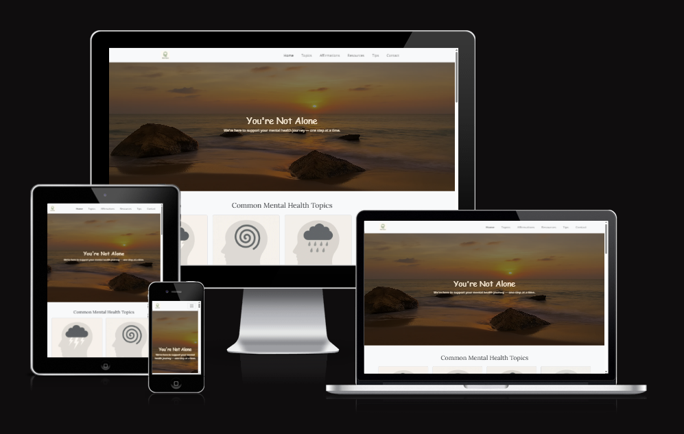
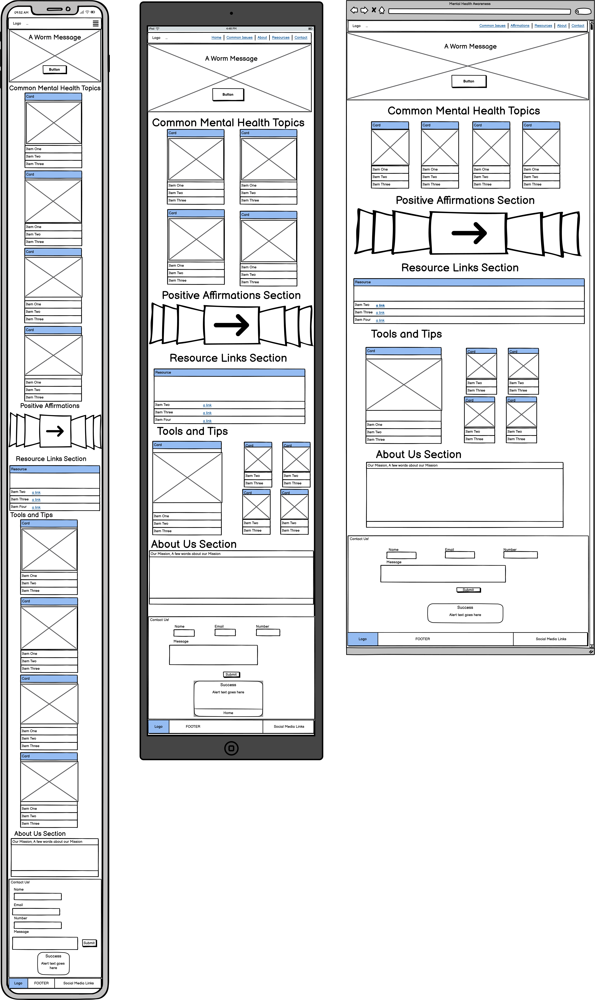
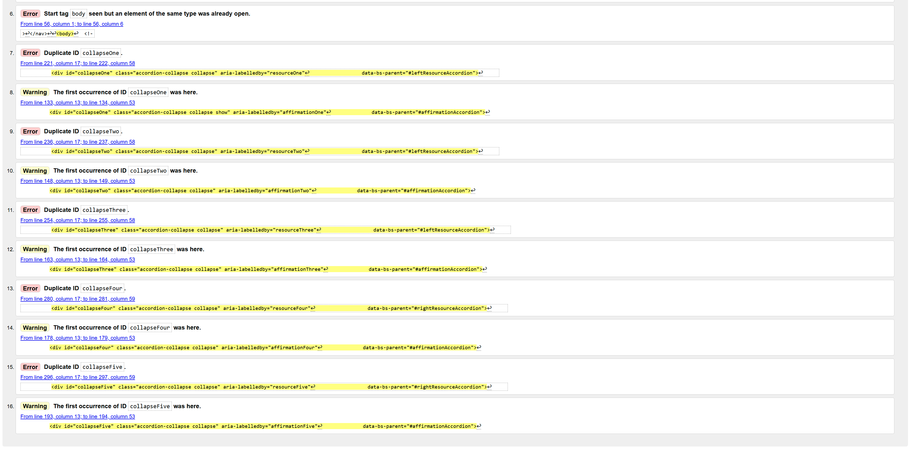

# Portfolio Individual Project 1 – Mind Haven: Mental Health Awareness Website

This website was created to fulfill the project brief for Code Institute's first individual assessment. It is designed to provide a welcoming, supportive space where users can learn about mental health, discover helpful resources, and find simple tools to manage everyday challenges.

📍 **Live link**: [Mind Haven – Mental Health Awareness](https://danbaloiu.github.io/mind-haven/)

---

## 🧠 Description

**Mind Haven** is a fully responsive, one-page HTML/CSS website using the Bootstrap framework. It is built for people seeking beginner-friendly, supportive information on mental health topics such as stress, anxiety, burnout, and depression. The site also offers tips for wellness and external support links.

The clean, calming visual design and consistent layout make the experience accessible across all devices.

---

## 🗂️ Wireframes

Wireframes were created using Balsamiq to define the content layout and visual hierarchy. Wireframes were created before the coding started and served as a guide for the project.

---

## 🤖 How AI & Tools Were Used

AI and related tools significantly enhanced the development process:

- **DALL·E** – Used to generate the hero image and custom illustrations for cards and sections, tailored to a calming mental health theme.
- **Squoosh** – Compressed and converted images to WebP format for optimal performance.
- **ChatGPT & GitHub Copilot** – Assisted in semantic HTML structure, Bootstrap layout decisions and validation fixes.
- **Lighthouse & W3C Validators** – Used for accessibility, performance, and code quality improvements.

---

## 📋 Features

### 🔝 Navigation Bar
- Fixed at the top with smooth Bootstrap collapse on smaller screens
- Links scroll to each main section

---

### 🌅 Hero Section
- Full-width background image with motivational headline
- Subtle gradient overlay to increase text readability

---

### 📘 Common Mental Health Topics
- Presented using Bootstrap cards with icons and short descriptions
- Includes: Stress, Anxiety, Depression, Burnout

---

### 💬 Positive Affirmations
- Uses a Bootstrap accordion to reveal affirmations on click
- Helps ground users and inspire a supportive mindset

---

### 🔗 Helpful Resources
- Two-column responsive accordion with links to real mental health support platforms
- Font Awesome icons and minimalist images used for context

---

### 🛠️ Tools and Tips
- Wellness tools shown as card tiles
- Covers: Journaling, Nature, Physical Activity, Breathing, Sleep Hygiene, Time Management

---

### 📬 Contact Form
- Name, Email, Phone, and Message fields
- Validates input before showing success modal
- Includes return-to-home button inside the modal

---

### 🟩 Modal Confirmation

- A Bootstrap modal is triggered when the contact form is successfully submitted.
- The modal provides a success message and a clear call-to-action.
- A "Back to Homepage" button allows users to quickly return to the top of the site.
- The modal only appears if all fields pass validation.

---

### 📎 Footer
- Aligned logo on the left
- Social icons (Facebook, Instagram, X) on the right, open in new tab

---

## 💡 Future Features

- ✅ Modal confirmation with fade-in animation
- 🔄 Testimonials carousel (future version)
- 📨 Newsletter sign-up option (future version)

---

## 🚧 Features Left to Implement

- 💬 Client Testimonials Carousel
- 📰 Newsletter Sign-Up Form (Could be added in a future iteration)

---

## 🛠 Technologies Used

- HTML5
- CSS3
- Bootstrap 5
- Font Awesome
- Google Fonts
- Squoosh (image compression)
- GitHub & GitHub Pages
- Copilot & Chat GPT (Image creation & code debugging)

---

## ✅ Testing

### ✔ HTML & CSS Validation

- HTML was validated via [W3C Nu Validator](https://validator.w3.org/).
- CSS was validated via [W3C CSS Validator](https://jigsaw.w3.org/css-validator/).
- All validation issues (e.g. duplicate IDs, missing `alt`, incorrect nesting) were corrected.

HTLM before optimisation:

HTLM after optimisation:

CSS Validation(Did not require any adjustments):

### 💡 Lighthouse Reports

Before optimization:

After image compression and structural corrections:

### ⚠️ Accessibility Improvements

- Font sizes and contrast verified manually
- Logical heading hierarchy (`h1 → h2 → h3`) applied
- All images include descriptive `alt` text
- Responsive design verified using Chrome DevTools and [Am I Responsive](https://ui.dev/amiresponsive/)

---

## 🚀 Deployment

- The site is deployed via **GitHub Pages**:
  - Pushed from the `main` branch
  - Live URL configured from repository settings
- Repository: [https://github.com/DanBaloiu/mind-haven](https://github.com/DanBaloiu/mind-haven)

---

## 📸 Credits & Attribution

- All images were generated using **DALL·E** and compressed with **Squoosh**.
- Content was curated with the help of **ChatGPT** and publicly available mental health information.
- Bootstrap and Font Awesome documentation were used throughout development.

---

## 💬 Acknowledgements

- Code Institute: for the structure and support materials
- My mentors and peers in the Full Stack Bootcamp
- GitHub Copilot & ChatGPT: for help debugging and documenting the project
